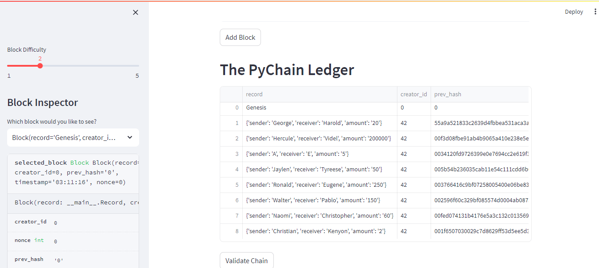
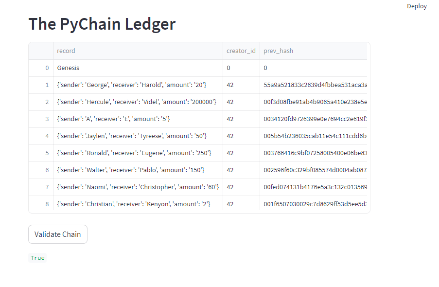

# Blockchain-Homework: PyChain Ledger

## Task
1. Create a new data class named Record (This class will serve as the blueprint for the financial transaction records that the blocks of the ledger will store)
2. Modify the existing `Block` data class to store `Record` data.
3. Add Relevant User Inputs to the Streamlit interface.
4. Test the PyChain Ledger by Storing Records.

## Instructions
### Step 1: Create a Record Data Class

1. Define a new class named `Record`.
2. Add the `@dataclass` decorator immediately before the `Record` class definition.
3. Add an attribute named `sender` of type `str`.
4. Add an attribute named `receiver` of type `str`.
5. Add an attribute named `amount` of type `float`.
(You’ll use this new `Record` class as the data type of your `record` attribute in the next section)

End Result: 
@dataclass
class Record:
    sender: str
    receiver: str
    amount: float

### Step 2: Modify the Existing Block Data Class to Store Record Data

1. In the `Block` class, rename the `data` attribute to `record`.
2.  2. Set the data type of the `record` attribute to `Record`.
  
End Result:
  record: Record

### Step 3: Add Relevant User Inputs to the Streamlit Interface

1. Delete the `input_data` variable from the Streamlit interface.
2. Add an input area where you can get a value for `sender` from the user.
3. Add an input area where you can get a value for `receiver` from the user.
4. Add an input area where you can get a value for `amount` from the user.
5. As part of the Add Block button functionality, update `new_block` so that `Block` consists of an attribute named `record`, which is set equal to a `Record` that contains the `sender`, `receiver`, and `amount` values. The updated `Block`should also include the attributes for `creator_id` and `prev_hash`.

End Result:
sender = st.text_input("Sender")
receiver = st.text_input("Receiver")
amount = st.text_input("Amount")

### Step 4: Test the PyChain Ledger by Storing Records

### Block Contents and Hashes

### Blockchain Validation

